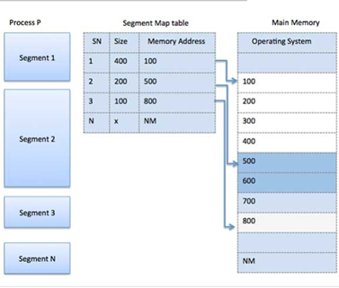
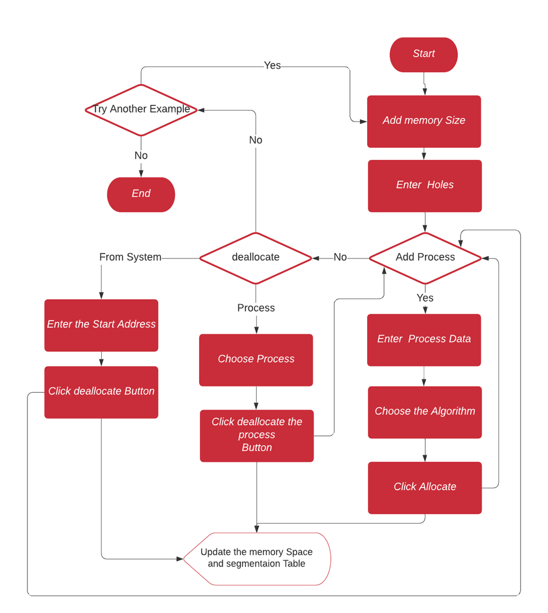
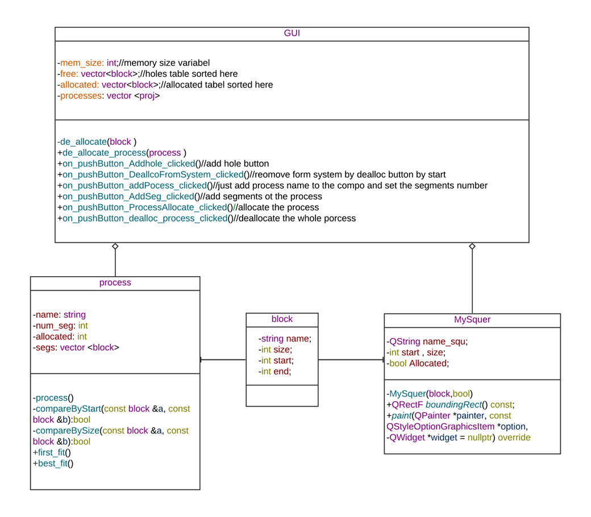
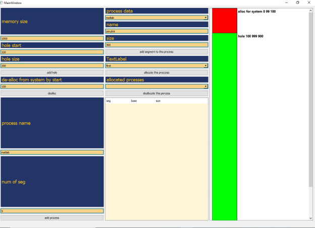
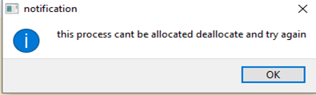
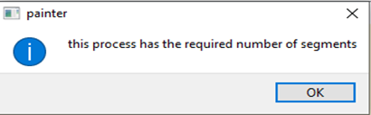
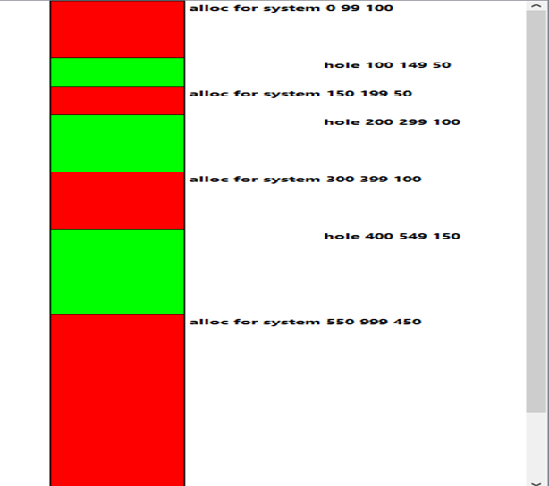
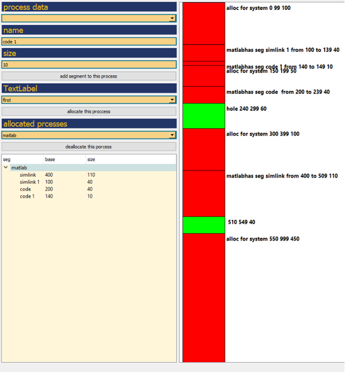
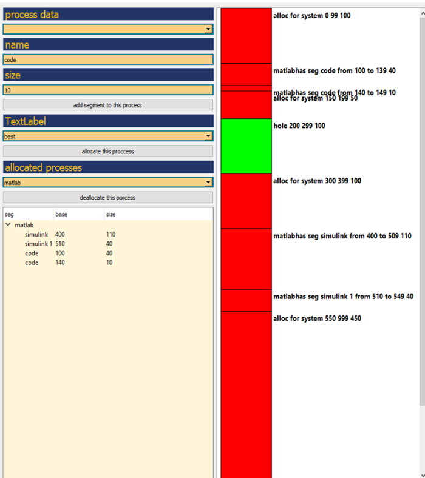

# Memory-Management-Application-Using-QT-framework

**Project Brief**
- Developed memory management algorithms using segmentation technic.
- Created GUI using C++ QT framework to visualize the memory allocation and deallocation using graphics view and the segmentation table. 

#  Background
## What is the function of memory management?
The memory management function In operating systems is to keep track o  the status either allocated or free. When memory is going to be allocated it determines where it should be allocated. It has all the memory (free and allocated) and tracks its status frequently.
The memory management system provides:
1.	Large Address Space
2.	Protection
3.	Memory Mapping
4.	Physical Memory Allocation for Processes
5.	Shared Virtual Memory

## Segmentation:
Segmentation is a memory management technique that divided each process into several segments with different sizes for each segment, for example, dividing the module into factions. And allocate each segment separately in the address space.

When a process is going to execute, we check the segmentation table to get the segments needed for the execution.

# The Project Requirements For Memory Allocation and Memory deallocation Project

- Inputs:
  - the data of the process name and segment number. 
  - the segment’s name and size. 
  - Allocation algorithm first or best algorithm. 
  - Deallocate a process. 
  - Deallocation address (for deallocating form system).
- Output:
  - Draw the memory space (holes, allocated for processes, allocated for the system).
  - Segmentation Table.

# Project Implementation
## Design overview
### Flow chart

To deallocate a process chose it from the compo box and click deallocate it would be deallocated, and the block memory would be updated.

### Class Diagram

### Classes Description
- Class block represents the block Which is one of three(a hole, allocated for a process, allocated for the System), we use this also to Draw in the GUI.
- Class MySquer I just made it to inherit from the library, that I use to draw a square in the Graphics View.
- The class process represents the process with its name, and segments and they include the segmentation table.
- Class GUI is used for interfacing, taking data, and making actions(messages, drawing memory space, drawing segmentation table).  

## GUI Design
| User Interface               |
|------------------------------|
|  |

### User Guide 
1.	Enter the size of the memory then a block of memory with this size would be drawn in the Graphics view on the Right.
2.	Enter the start and size for a hole then Click add hole, A hole at the start would add by the size. 
3.	Entre the start of An allocated block you want to deallocate from the system and Click the Deallocate Button, the block would be free.
4.	Add the process name and the segment number then it would appear in the Process Data compo box to enter its data. 
5.	Choose the process you want and insert the segments’ name and their size.
6.	If you entered all the process segments then you are able to choose the allocation algorithm and click allocate and the memory space would be updated if the process is successfully allocated else an error message would appear.

### Warning massages

| if the user click on the process to deallocate | process can’t allocate as one or more segment does not have a suitable space |
|-----------------------------------------------|------------------------------------------------------------------------------|
|                   |                                                  |
| when trying deallocate a process segment.     | Indecation for the process has all the segments                              |
|                   |                                                  |

- There are more Warning messages.

# Execution Example
 ### **Initiate The System**
- Input:
  - Add three holes at (100,50), (200,100), (400,150).

| Program Output               | 
|------------------------------|
|  |

  ### **Use First Allocation**
- Input:
  - Add a process with three segments Simulink(110), Simlink2(40), code(40), code2(10)

| Program Output                | 
|-------------------------------|
|  |

  ### **Use Best Allocation**
- Input:
  - Add a process with three segments Simulink(110), simlink2(40), code(40), code2(10)

| Program Output                | 
|-------------------------------|
|  |
